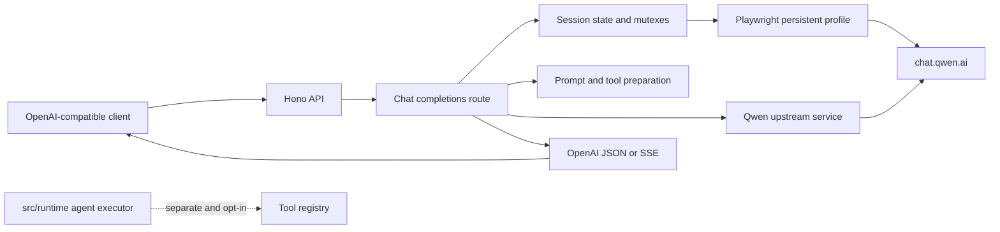

# QwenProxy

QwenProxy is a local, OpenAI-compatible gateway for Qwen Chat. It keeps the browser session on the operator's machine and exposes a familiar Chat Completions API for clients such as Hermes and other OpenAI-compatible applications.

> Use this project only where Qwen's terms, your account policies, and applicable law allow it.

**Architecture:** OpenAI/Hermes client → Hono API → session and request layer → Qwen via Playwright and HTTP → OpenAI-compatible JSON or SSE response.

## What it does

- Exposes `GET /v1/models` and `POST /v1/chat/completions`.
- Supports streaming and non-streaming Chat Completions.
- Preserves reasoning/thinking content when Qwen provides it.
- Translates Qwen responses into OpenAI-style choices, usage, finish reasons, and tool calls.
- Supports isolated sessions with reset, delete, list, and fork operations.
- Parses incremental JSON, native structured calls, and Qwen XML tool-call markup.
- Keeps tool calls limited to the tools supplied by the request and the tools actually shown to Qwen.
- Propagates client cancellation through upstream requests and mutexes.
- Supports optional account rotation when Qwen applies account limits.
- Runs deterministic tests without opening a browser by default.
- Keeps the experimental agent runtime separate from the main HTTP endpoint.

## Architecture



The HTTP route is a proxy, not an automatic local tool executor. It sends the request's allowed tool definitions to Qwen, validates the returned calls, and gives those calls back to the client. The separate `src/runtime/` executor is tested independently and is not invoked automatically by `/v1/chat/completions`.

## Requirements

- Node.js 20 or newer.
- A Qwen web account.
- A supported Playwright browser when using a real Qwen session.
- Network access to `chat.qwen.ai`.

## Quick start

```bash
# 1. Create local configuration
cp .env.example .env

# 2. Fill in the Qwen account fields in .env.
#    Keep API_KEY empty when the service is used only on localhost.

# 3. Install dependencies and the browser
npm ci --include=dev
npx playwright install chromium

# 4. Start the gateway
npm start
```

The default listener is `http://127.0.0.1:3000`.

Check that the process is reachable:

```bash
curl http://127.0.0.1:3000/health
```

```json
{"status":"ok"}
```

For the first login, set `HEADLESS=false` in `.env` and start the gateway with a visible browser. The profile is reused on later starts.

## API

### Health

```http
GET /health
```

This endpoint does not require an API key.

### Models

```bash
curl http://127.0.0.1:3000/v1/models
```

### Chat Completions

Minimal request:

```bash
curl http://127.0.0.1:3000/v1/chat/completions \
  -H 'Content-Type: application/json' \
  -d '{
    "model": "qwen3.8-max-preview",
    "messages": [{"role": "user", "content": "Hello"}],
    "stream": true
  }'
```

If `API_KEY` is configured, send it as a Bearer token:

```bash
-H 'Authorization: Bearer YOUR_API_KEY'
```

The gateway validates the request before contacting Qwen. Supported controls include:

- `max_tokens` and `max_completion_tokens`;
- `temperature`, `top_p`, `stop`, `presence_penalty`, `frequency_penalty`, and `seed`;
- `user`, `n=1`, and `stream_options.include_usage`;
- `tool_choice` and OpenAI function tools;
- `response_format` with `text`, `json_object`, and the supported subset of `json_schema`.

Invalid requests return an OpenAI-shaped `400` response. Streaming usage is included only when `stream_options.include_usage` is true.

## Tool calling

Send standard OpenAI function definitions:

```json
{
  "model": "qwen3.8-max-preview",
  "messages": [
    {"role": "user", "content": "Read package.json."}
  ],
  "tools": [
    {
      "type": "function",
      "function": {
        "name": "read_file",
        "description": "Read a UTF-8 text file",
        "parameters": {
          "type": "object",
          "properties": {
            "path": {"type": "string"}
          },
          "required": ["path"],
          "additionalProperties": false
        }
      }
    }
  ]
}
```

Qwen may return a content call such as:

```xml
<tool_call>{"name":"read_file","arguments":{"path":"package.json"}}</tool_call>
```

The gateway also accepts native structured tool-call fragments. Before returning a call, it checks the tool name, parses the arguments, and validates them against the request schema. Calls for tools that were not exposed to Qwen are discarded.

The client or agent is responsible for executing the tool and sending the resulting `assistant.tool_calls` and `tool` messages in the next request.

## Sessions

Use `X-Session-Id` to keep conversations separate:

```bash
curl http://127.0.0.1:3000/v1/chat/completions \
  -H 'Content-Type: application/json' \
  -H 'X-Session-Id: project-a' \
  -d '{
    "model": "qwen3.8-max-preview",
    "messages": [{"role": "user", "content": "Continue the conversation."}]
  }'
```

Available session endpoints:

```text
GET    /v1/session?id=<id>
GET    /v1/sessions
POST   /v1/session/reset?id=<id>
DELETE /v1/session?id=<id>
POST   /v1/session/fork
```

`X-New-Session: true` starts a fresh Qwen chat. An explicitly supplied `X-Session-Id` is preserved when that header is used.

Session IDs are limited to 128 characters and accept letters, numbers, `.`, `_`, `:`, `/`, and `-`. The in-memory and persisted session store is bounded; inactive non-main sessions expire automatically.

## Configuration

Copy `.env.example` to `.env` and keep the real file out of Git.

| Variable | Default | Purpose |
| --- | --- | --- |
| `PORT` | `3000` | Local HTTP port. |
| `HOST` | `127.0.0.1` | Address used by the Node server. Non-loopback hosts require `API_KEY`. |
| `BIND_HOST` | `127.0.0.1` | Host address published by Docker Compose. |
| `API_KEY` | empty | Optional Bearer token for `/v1/*`. Required for non-loopback deployments and Compose. |
| `CORS_ORIGIN` | empty | Optional browser origin. CORS is disabled when empty. |
| `BROWSER` | `chromium` | `chromium`, `firefox`, `webkit`, `chrome`, or `edge`. |
| `HEADLESS` | `true` | Set to `false` for visible login and debugging. |
| `QWEN_MAX_TOOLS` | `64` | Maximum number of tool schemas sent to Qwen. Omitted tools are also rejected in returned calls. |
| `QWEN_EMAIL` / `QWEN_PASSWORD` | empty | Primary Qwen account. |
| `QWEN_EMAIL_2` … `_10` | empty | Optional accounts used for rotation. |
| `TEST_MOCK_PLAYWRIGHT` | `false` | Test-only browser mock. Keep disabled in deployments. |
| `RUN_LIVE_QWEN_TESTS` | `0` | Explicit opt-in for tests that use a real Qwen account. |

## Security notes

- Keep `API_KEY` enabled whenever the service is reachable beyond localhost.
- Do not commit `.env`, `qwen_profile/`, cookies, prompt dumps, logs, or account credentials.
- The persistent profile contains Qwen session data and must be protected like a secret.
- On POSIX systems, the profile and session file use private permissions and the service refuses insecure session state.
- On Windows, startup removes inherited ACLs from the persistent profile, grants access only to the current user and SYSTEM, verifies the effective entries, and refuses to start when that check fails.
- Cookies are read and sent only for the configured Qwen domains. They are not written to `session.json`.
- Client disconnects abort upstream work and release session and account locks.
- The runtime executor remains separate from the HTTP route until an explicit execution and approval policy is defined.
- Review Qwen's terms and account limits before deploying or redistributing the gateway.

## Docker

```bash
cp .env.example .env
# Set QWEN credentials and API_KEY in .env.
docker compose up --build
```

Compose is deliberately fail-closed:

- host publication defaults to `127.0.0.1`;
- `API_KEY` must be present before Compose starts;
- the container listens on `0.0.0.0` internally, while the host binding stays loopback-only by default;
- the profile is mounted at `/app/qwen_profile`;
- the image runs as the non-root `pwuser` user and uses `dumb-init`;
- container logs are capped at 10 MB per file with three retained files.

If you intentionally publish the service on a LAN address, set both an appropriate `BIND_HOST` and a strong `API_KEY`.

## Testing

Install development dependencies and run the standard checks:

```bash
npm ci --include=dev
npm run typecheck
npm test
npm audit --include=dev
```

The full local gate is:

```bash
npm run check
```

The default suite mocks Playwright and skips live Qwen tests. Live tests require a configured environment and explicit opt-in:

```bash
RUN_LIVE_QWEN_TESTS=1 npm test
```

Live tests use account quota and are not a replacement for the deterministic suite.

CI runs typechecking, deterministic tests, dependency auditing, and a production-install smoke test on Node.js 20 and 22.

## Repository layout

```text
src/
├── index.ts                HTTP server, middleware, and startup checks
├── routes/chat.ts          OpenAI-compatible chat route and sessions
├── services/qwen.ts        Qwen requests, SSE, retries, and deadlines
├── services/playwright.ts  Browser profile, login, cookies, accounts, and locks
├── utils/openai-request.ts Request validation and response-format checks
├── utils/sse.ts            Incremental, bounded, abortable SSE parser
├── tools/parser.ts         JSON/XML/native tool-call parsing
├── tools/schema.ts         JSON Schema validation for tool arguments
├── runtime/                Separate agent executor and event state machine
└── tests/                  Deterministic regression and opt-in live tests

Dockerfile                  Production image definition
docker-compose.yml          Local/container deployment with network guards
.env.example                Redacted configuration template
.github/workflows/ci.yml    Continuous integration checks
```

## License

This project is distributed under the ISC license. See `LICENSE` for the full text and preserve applicable upstream attribution when redistributing.
