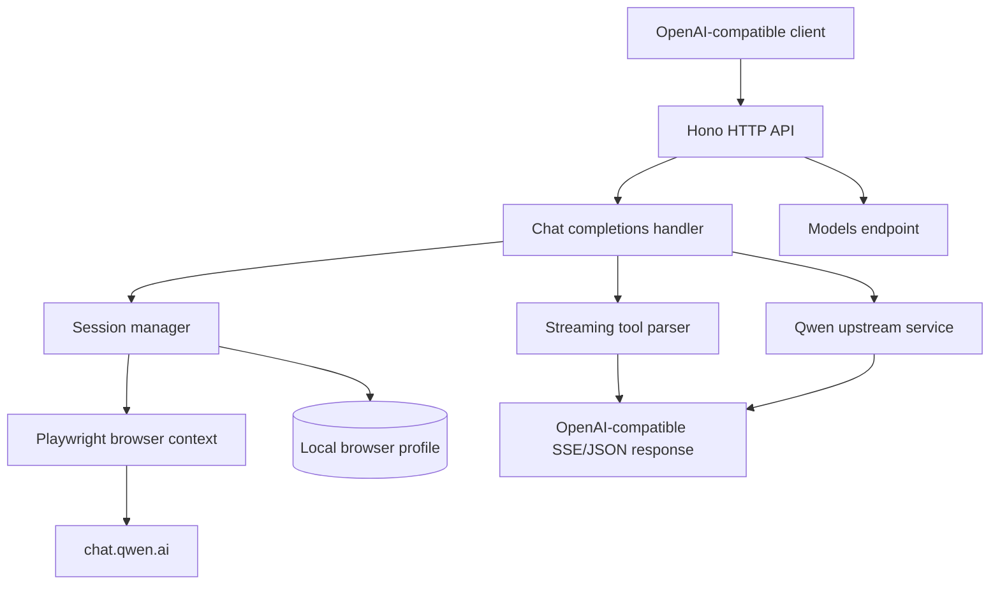

# QwenProxy

OpenAI-compatible gateway for Qwen Chat sessions, built for local agent runtimes that need streaming, tool calling and isolated conversation state.

The project translates the OpenAI Chat Completions contract into a browser-backed Qwen session while keeping credentials, cookies and browser profiles on the operator's machine.

## Highlights

- OpenAI-compatible `/v1/models` and `/v1/chat/completions` endpoints
- Streaming and non-streaming responses with reasoning content
- Tool calling with resilient incremental XML/JSON parsing
- Isolated sessions for agents and concurrent-request protection
- Local Playwright profile with explicit session lifecycle
- Deterministic unit tests that never launch a browser
- Opt-in live stress tests for environments with Qwen access

## Architecture



## Repository layout

```text
src/
├── index.ts              HTTP server and middleware
├── routes/chat.ts        OpenAI-compatible chat endpoint
├── services/qwen.ts      Qwen session and upstream requests
├── services/playwright.ts Browser lifecycle and local profile
├── tools/parser.ts       Incremental tool-call parser
├── runtime/              Agent execution helpers
└── tests/                Unit and integration tests
```

## Run locally

Requirements: Node.js 20+ and a local Qwen browser session.

```bash
npm ci
cp .env.example .env
npm run dev
```

The service listens on the port configured in `.env`. Keep credentials and browser data outside version control.

## Verification

```bash
npm run typecheck
npm test
```

The default test suite uses a Playwright mock and never opens Chrome. Live API stress tests are intentionally disabled unless explicitly enabled:

```bash
RUN_LIVE_QWEN_TESTS=1 npm test
```

## Design notes

- Upstream rate-limit errors are returned with an explicit status and message.
- Streaming usage metadata is emitted in the final SSE event.
- Malformed or fragmented model output is preserved for observability instead of being silently discarded.
- Browser startup is isolated behind a test switch so CI remains headless and deterministic.

## License and attribution

This repository is an independent adaptation of a browser-backed Qwen gateway. Upstream attribution and license notices are preserved where applicable. Review the license before redistributing a deployment.
